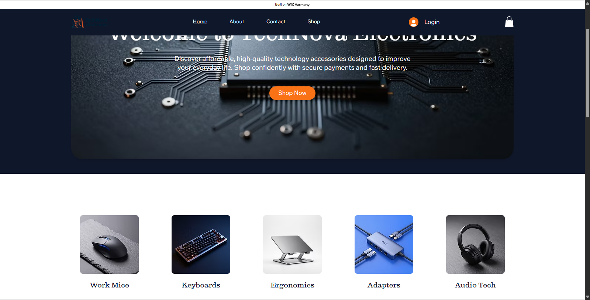
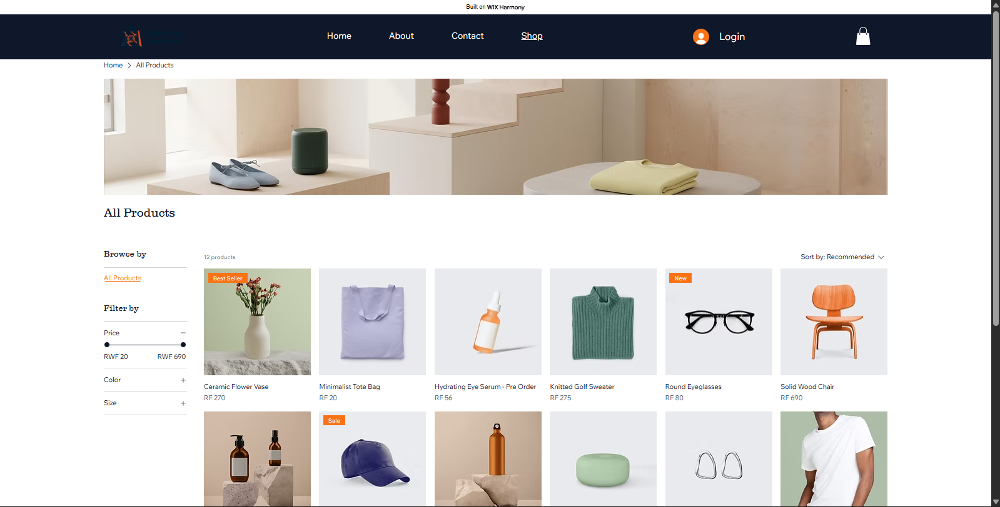
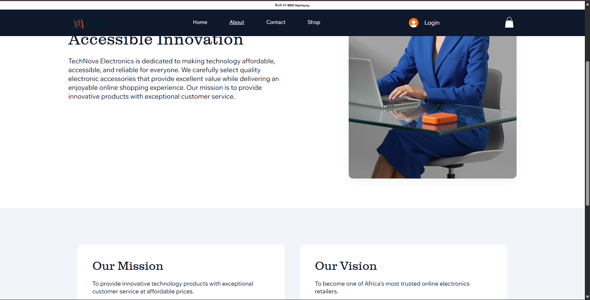
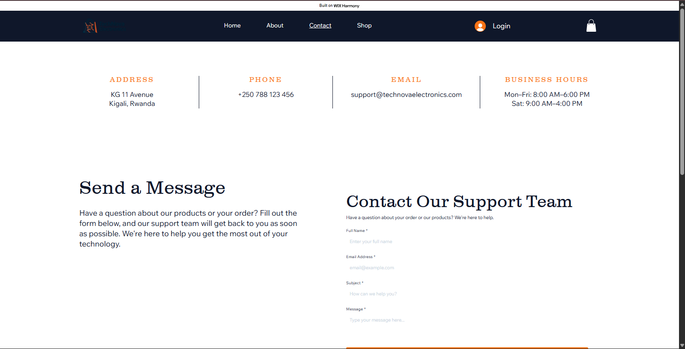
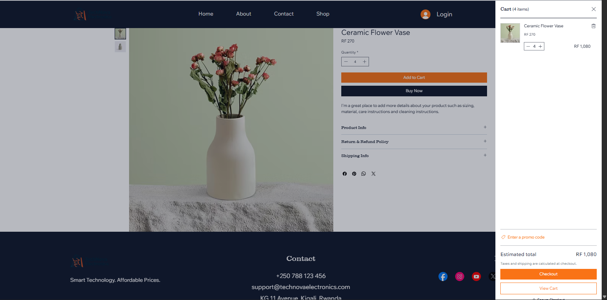

 TechNova Electronics

Smart Technology. Affordable Prices.

 Student Information

Student Name: BYIRINGIRO Emmanuel
Student ID: 29674
Course: INSY 8313 – Management Information System (MIS)
Instructor: Eric Maniraguha
Assignment: Group Assignment IV-b – No-Code/Low-Code E-Commerce Application Development Project

 Project Title

TechNova Electronics – No-Code E-Commerce Website

 Platform Used

Wix

 Project Description

TechNova Electronics is a modern e-commerce website developed using the Wix no-code platform as part of the Management Information System (MIS) course project. The objective of this project was to transform a previously designed Figma e-commerce interface into a fully functional online store without traditional programming.

The website provides customers with an easy and user-friendly shopping experience by allowing them to browse products, view prices and descriptions, add items to a shopping cart, and contact the business through a contact form.

 Features Implemented

* Responsive homepage
* Professional navigation menu
* Product catalog with five electronic products
* Product images
* Product prices and descriptions
* Shopping cart functionality
* About page
* Contact page
* Contact form
* Mobile-friendly design

 Website Pages

* Home
* Products
* About
* Contact
* Cart

 Screenshots

 Homepage

 Products Page

About Page

 
 Contact / Cart Page

cart page

 Challenges Encountered

During the development of this project, several challenges were encountered:

* Learning how to use the Wix website builder effectively.
* Customizing the website template to match the intended business design.
* Organizing products with appropriate descriptions and prices.
* Configuring the shopping cart and page navigation.
* Ensuring the website displayed correctly on different screen sizes.

These challenges were overcome through continuous testing, customization, and use of Wix's built-in tools.

 Lessons Learned

This project provided practical experience in:

* Developing websites using a no-code platform.
* Applying UI/UX design principles.
* Building an e-commerce website structure.
* Managing products and website content.
* Publishing a live website.
* Documenting software projects using GitHub and Markdown.

 Technologies Used

* Wix
* Wix Stores
* Wix Forms
* GitHub
* Markdown

 Live Website
link: https://byiringiroemmy960.wixsite.com/technova-electronics

 Repository Structure

E-Commerce-Project/
│
├── README.md
│
└── images/
    ├── homepage.png
    ├── products.png
    └── contact-cart.png

 Conclusion

This project successfully demonstrates the development of a functional e-commerce website using a no-code platform. It combines website design, e-commerce concepts, user-friendly navigation, and project documentation into a complete digital solution. The experience gained through this assignment strengthens practical skills in website development and digital project management.

 Author

BYIRINGIRO Emmanuel

© 2026 TechNova Electronics. All Rights Reserved.
